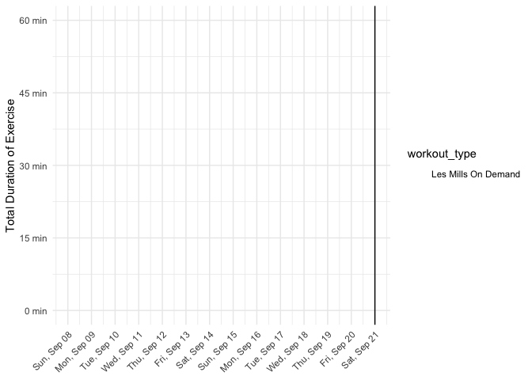
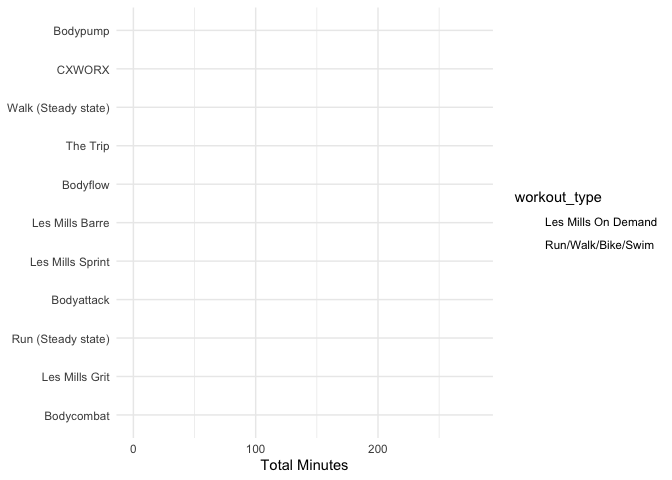

Workouts - EDA
================

``` r
library(tidyverse)
```

    ## ── Attaching packages ────────────────────────────────── tidyverse 1.2.1 ──

    ## ✔ ggplot2 3.2.1       ✔ purrr   0.3.2  
    ## ✔ tibble  2.1.3       ✔ dplyr   0.8.0.1
    ## ✔ tidyr   0.8.3       ✔ stringr 1.4.0  
    ## ✔ readr   1.3.1       ✔ forcats 0.4.0

    ## ── Conflicts ───────────────────────────────────── tidyverse_conflicts() ──
    ## ✖ dplyr::filter() masks stats::filter()
    ## ✖ dplyr::lag()    masks stats::lag()

``` r
library(googlesheets)
library(lubridate)
```

    ## 
    ## Attaching package: 'lubridate'

    ## The following object is masked from 'package:base':
    ## 
    ##     date

``` r
file_data <- here::here("data/workouts.rds")
colors <- c(
  "Les Mills On Demand" = "#ff7f00",
  "Weights" = "#984ea3",
  "Run/Walk/Bike/Swim" =  "#4daf4a",
  "Stretch" = "#377eb8",
  "Other" = "#e41a1c"
)

#==============

df <- read_rds(file_data)
```

# Time series of duration of workout over the past two weeks (could have other periods of time)

``` r
df %>%
  filter(date > today() - days(13)) %>% 
  ggplot(aes(date, duration)) +
  geom_col(aes(fill = workout_type), position = "stack") +
  geom_vline(xintercept = today()) +
  scale_x_date(
    date_breaks = "1 days", 
    date_labels = "%b %d"
  ) +
  scale_y_continuous(
    breaks = seq(0, 120, by = 15), 
    labels = function(x) str_c(x, " min")
  ) +
  scale_fill_manual(values = colors) +
  theme_minimal() +
  theme(axis.text.x = element_text(hjust = 1, angle = 45)) +
  labs(x = NULL, y = "Total Duration of Exercise")
```

<!-- -->

# What type of exercise have I been doing? (Also allow to filter to recent)

``` r
df %>%
  mutate(
    type = case_when(
      workout_type == "Les Mills On Demand" ~ program,
      workout_type == "Run/Walk/Bike/Swim" ~ as.character(glue::glue("{cardio_type} ({cardio_style})")),
      TRUE ~ program
    )
  ) %>%
  group_by(workout_type, type) %>%
  summarize(duration = sum(duration)) %>%
  ggplot(aes(reorder(type, duration), duration)) +
  geom_col(aes(fill = workout_type)) +
  scale_fill_manual(values = colors) +
  coord_flip() +
  theme_minimal() +
  labs(
    x = NULL,
    y = "Total Minutes"
  )
```

<!-- -->

# Month view

``` r
df %>% 
  group_by(month = month(date), day = mday(date)) %>% 
  summarize(total_minutes = sum(duration, na.rm = TRUE)) %>% 
  ungroup() %>% 
  ggplot(aes(xmin = day, ymin = month, xmax = day + 1, ymax = month + 1,fill = total_minutes)) +
  geom_rect()
```

<!-- -->
